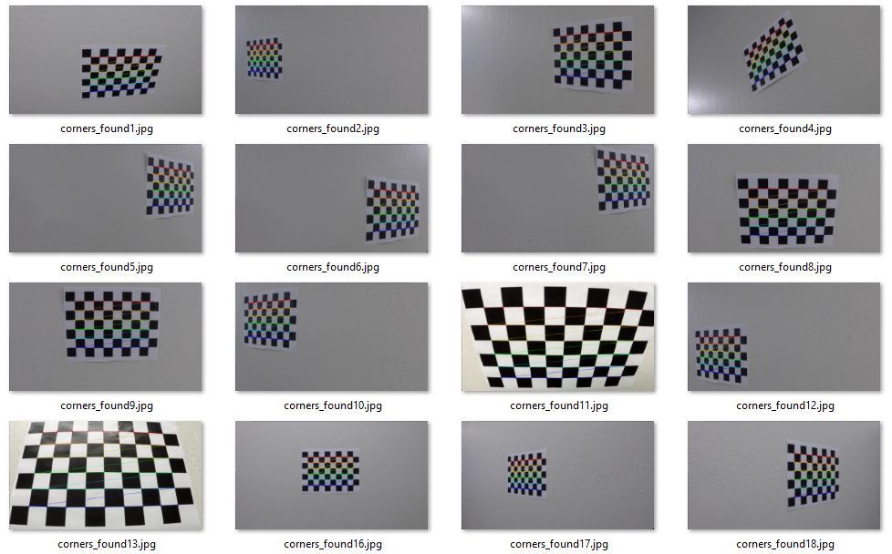
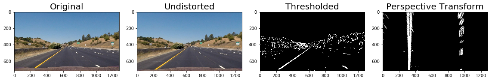
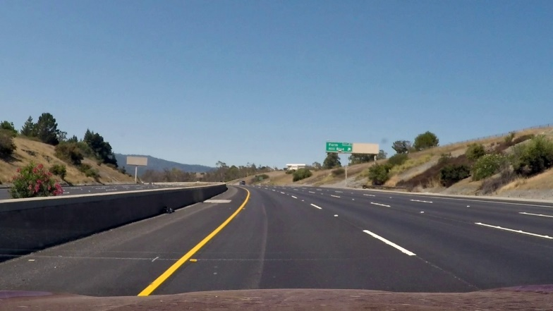
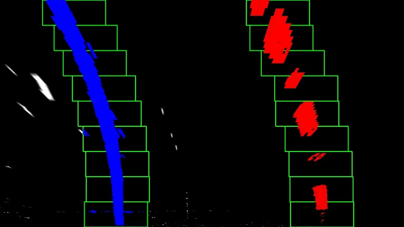
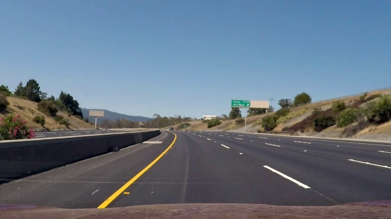
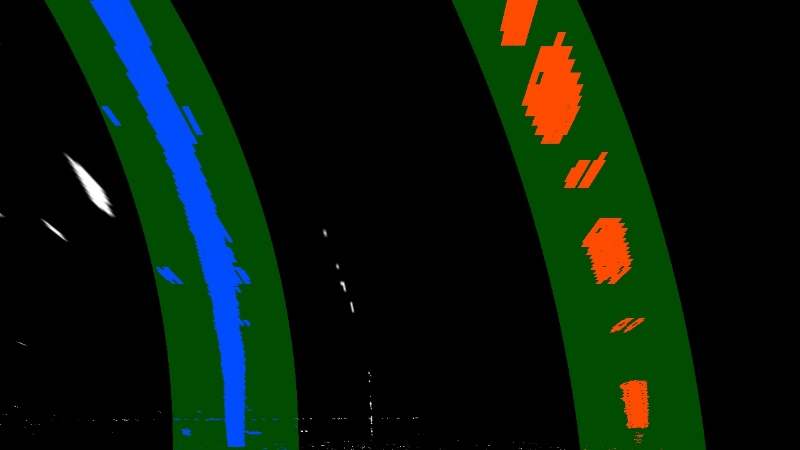
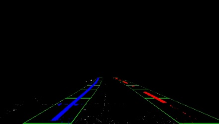
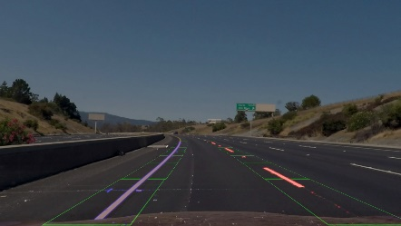
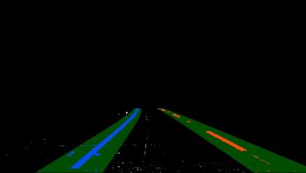
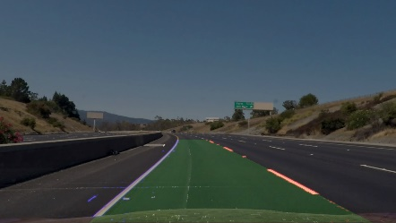

# **Self-Driving Car Engineer Nanodegree** #

# **Project4: Advanced Lane Finding** #

## **INTRODUCTION** ##

**The** purpose of the project is to find the lanes that bound the path
of a car from a video file. Various image processing techniques will be
used. An output video containing the highlighted found lanes as well as
their curvature will be rendered.

## **CAMERA CALIBRATION** ##

Multiple images of a chessboard pattern taken from different angles were
processed the ChessboardCorners CV2 function to find corners:

{width="6.5in"
height="4.040972222222222in"}

After that the calibrateCamera CV2 function is used on the found corners
(compared to a rectangular corner pattern) to obtain the “mtx” and
“dist” coefficients that will later be applied to all images taken using
the same camera.

## **THRESHOLD IMAGE** ##

To get rid of all the unnecessary detail on the photos and just focus on
the lanes, Sobel edge detection filters (derivaties of image pixels) are
applied to the photo. For this project, a Sobel in the x-dir was
applied.

Also, the RGB channels were converted to HLS (Hue, Lightness,
Saturation) channels. The S channel was also used.

A threshold combination of Sobel-x and S channel was applied to the
images using the value ranges shown below:

*s\_thresh=(100, 255), sx\_thresh=(20, 100)*

See the 2 images below for before and after applying the threshold
function:

{width="3.2906649168853894in"
height="1.0742979002624673in"}

{width="3.2319925634295714in"
height="1.074180883639545in"}

## **PERSPECTIVE TRANSFORM** ##

A perspective transformed is performed on the ‘Thresholded’ images. The
technique involves defining 4 points that lay on a plane, and defining
the location of those 4 points viewed from a parallel plane. The
function getPerspectiveTransform from CV2 was used. See below the 2
images before/after the transform:

{width="3.2558136482939632in"
height="1.0743055555555556in"}

{width="3.2444444444444445in"
height="1.0743055555555556in"}

## **DETECTING THE LANE PIXELS** ##

A 2 step approach is taken to find the lane pixels:

-First, a histogram on the bottom rows of the image are used to find
where the lanes start. The centroid of the left/right lanes are found,
and the next row up is found using a local histogram, and so on until
getting to the top of the image. A polynomial fit is done on the
centroid of the left/right blocks. Then using the polyfit coefficients
the entire curve from bottom to top is calculated. This function is
called “sliding\_windows1” function in the code.

-Second, for the 2^nd^ image frame and all the other images, there is no
need to use the above technique. Using the top most point, a narrower
search area is created. The new centroids are found, polyfit done, and
curves calculated. This function is called “sliding\_windows2”.

The photos below show the 1^st^ and 2^nd^ sliding windows functions
applied to the 1^st^ and 2^nd^ image frame respectively after the
perspective transform:

  {width="3.5223884514435695in" height="1.9800043744531934in"}   {width="3.5373140857392826in" height="1.9897386264216972in"}
  ---------------------------------------------------------------------------------------------------- ----------------------------------------------------------------------------------------------------
  {width="3.504861111111111in" height="1.9701498250218723in"}    {width="3.6095767716535434in" height="2.033195538057743in"}

## **TRANSFORM BACK INTO ORIGINAL PERSPECTIVE** ##

The found lanes are transformed back into the original perspective view
to be overlaid with the original video images:

  {width="2.0in" height="1.13in"}    {width="2.0in" height="1.13in"}    {width="2.01in" height="1.13in"}
  ------------------------------------------------------------------------ ------------------------------------------------------------------------ -------------------------------------------------------------------------
  {width="2.0in" height="1.13in"}   {width="2.0in" height="1.13in"}   {width="2.01in" height="1.13in"}

The same 4 points for the plane are used, but switched inside the
getPerspectiveTransform CV2 function.

## **LANE CURVATURE AND VEHICLE POSITION** ##

*The curvature
R*​*curve*​​=​∣​*dy*​2​​​​*d*​2​​*x*​​∣​​\[1+(​*dy*​​*dx*​​)​2​​\]​3/2​​​​
*can be calculated from the coefficients of the lane fitting :
f*(*y*)=*Ay*​2​​+*By*+*C*

It is necessary to scale the curvature meter units. This is done by
using a 30/720 meters/pixel in the y-dir and 3.7/200 meters/pixel in the
x-axis.

The center of the car is measured to be at 665 pixels in the x-dir. The
average of the left/right lanes on the bottom row is calculated. If the
average is greater than 665 pixels, the vehicle is to the right of the
centerline, and if less to the left of the centerline.

## **VIDEO PROCESSING PIPELINE** ##

> Convert MP4 to JPGs
>
> for JPGs:
>
> read image
>
> undistort
>
> threshold
>
> perspective transform
>
> if first frame:
>
> sliding\_windows1
>
> else:
>
> sliding\_windows2b
>
> fit new polynomials to x,y in world space
>
> calculate the new radii of curvature
>
> calculate car center w.r.t center lane
>
> transformed back image
>
> combine image (lanes highlight + original)
>
> average values every 5 frames
>
> curvature
>
> car center
>
> write JPG
>
> Convert JPGs to MP4

## **ASSUMPTIONS THAT COULD CAUSE THE MODEL TO FAIL** ##

-going on a road that is not planar. For example, a steep hill. The
perspective projection would not work correctly.

-extremely high angles of lanes (low radius of curvature), would only
used a small portion of the entire picture frame.

-if the car does a lane change, the algorithm would have to change to
catch the new lane. This could make use of the center to lane position
detection.
